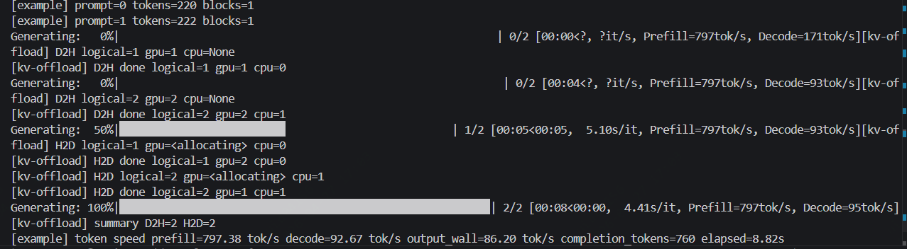

# Nano-vLLM-OFFLOAD

A lightweight vLLM-style inference engine with CPU-GPU hybrid offload support.

This project is based on `nano-vllm` and keeps the codebase small and readable while adding offload-oriented inference features.

## Key Features

* **Weight offload on `master`** - The `master` branch refers to the `llama.cpp` style weight offload design and supports CPU-GPU hybrid inference.
* **KV cache offload on `GPU_OFFLOAD`** - The `GPU_OFFLOAD` branch supports vLLM-style KV cache offload, moving cold KV blocks between GPU and CPU.
* **Readable inference engine** - A compact Python implementation of vLLM-style offline inference.
* **Continuous batching** - Supports batching requests dynamically during generation.
* **Chunked prefill** - Long prompts can be prefetched in chunks instead of requiring one huge prefill batch.
* **Prefix caching** - Reuses already computed prefix KV blocks when possible.
* **TP=1 KV offload path** - The current KV offload implementation targets tensor parallel size 1.


## Branch Design

### `master`: Weight Offload

The `master` branch focuses on weight offload.

It follows the idea used by `llama.cpp`: only part of the model weights need to stay on GPU, while other layers can remain on CPU and be moved or activated according to the configured offload policy.

This enables CPU-GPU hybrid inference when GPU memory is limited.

Typical goals:

* Reduce static GPU memory usage from model weights.
* Keep hot or currently needed layers on GPU.
* Allow small-memory GPUs to run models that would otherwise exceed VRAM.
* Provide a simple CPU-GPU mixed inference path.

### `GPU_OFFLOAD`: KV Cache Offload

The `GPU_OFFLOAD` branch adds vLLM-style KV cache offload.

Unlike old sequence-level preemption, this implementation does not preempt and recompute whole requests. Instead, it treats KV cache blocks as logical blocks. When GPU KV cache space is not enough, cold GPU-resident blocks are selected by LRU and offloaded to CPU.

Core behavior:

* `seq.block_table` stores logical KV block ids.
* Each logical block may have a GPU physical block id and/or a CPU physical block id.
* Before attention runs, logical block ids are translated into GPU physical block ids.
* If a needed logical block is only on CPU, it is loaded back to GPU first.
* If GPU KV space is full, the least recently used unprotected GPU block is copied to CPU and its GPU slot is released.
* Active blocks required by the current batch are protected and will not be evicted.


install the original upstream project:

```bash
pip install git+https://github.com/GeeeekExplorer/nano-vllm.git
```


Minimal KV offload example:


## KV Offload Parameters

| Parameter | Description |
| --- | --- |
| `enable_kv_offload` | Enables CPU KV cache and block-level KV offload. |
| `num_cpu_kvcache_blocks` | Number of KV blocks allocated on CPU. |
| `cpu_kvcache_gb` | Alternative CPU KV cache capacity setting by memory size. |
| `max_num_kvcache_blocks` | Caps GPU KV cache blocks, useful for forcing offload during tests. |
| `min_num_kvcache_blocks` | Minimum GPU KV cache blocks to allocate. |
| `min_kvcache_memory_bytes` | Minimum GPU KV memory reservation. |
| `kv_offload_policy` | Currently `lru`. |
| `kv_prefetch_sync` | Current MVP uses synchronous H2D loading. |
| `kv_offload_async` | Current MVP keeps async offload disabled. |

## KV Offload Trace

The test script can print KV movement traces:

```text
[kv-offload] D2H logical=1 gpu=1 cpu=None
[kv-offload] D2H done logical=1 gpu=1 cpu=0
[kv-offload] H2D logical=1 gpu=<allocating> cpu=0
[kv-offload] H2D done logical=1 gpu=2 cpu=0
```

```python
from nanovllm import LLM, SamplingParams

path = "/home/zl/hrz/temp/nano-vllm/Qwen3-0.6B"

llm = LLM(
    path,
    tensor_parallel_size=1,
    enforce_eager=True,
    enable_kv_offload=True,
    num_cpu_kvcache_blocks=16,
    max_num_batched_tokens=512,
    max_num_seqs=16,
    max_model_len=768,
    max_num_kvcache_blocks=3,
    min_num_kvcache_blocks=1,
    min_kvcache_memory_bytes=0,
)

sampling_params = SamplingParams(temperature=0.6, max_tokens=256)
prompts = ["Hello, Nano-vLLM-OFFLOAD."]
outputs = llm.generate(prompts, sampling_params)
print(outputs[0]["text"])
```
Meaning:

* `D2H`: Device to Host, GPU to CPU.
* `H2D`: Host to Device, CPU to GPU.
* `logical`: logical KV block id stored in `seq.block_table`.
* `gpu`: physical GPU KV block id.
* `cpu`: physical CPU KV block id.

## Running The Test


The example prints:

* GPU KV cache allocation.
* CPU KV cache allocation.
* Prompt token/block count.
* KV offload trace.
* Prefill/decode token speed.
* Final generated text.

Example speed summary format:



## Current Limitations

* KV cache offload currently supports `tensor_parallel_size=1`.
* KV cache H2D/D2H is synchronous in the current MVP.
* GPU block pressure is handled by block-level LRU eviction, not sequence-level preemption.
* A single active sequence still needs its full attention working set resident on GPU. KV offload can evict inactive blocks, but it cannot make one sequence's required context exceed the configured GPU KV block capacity.

